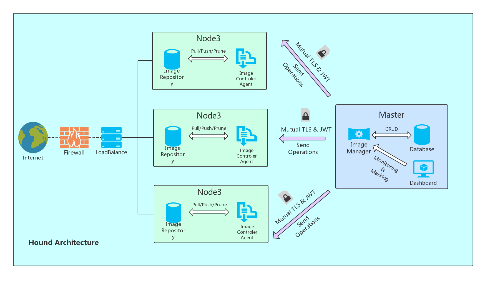

# Hound
Hound is a distributed Docker container image management tool.
It is developed by go with good concurrency and fast speed.
It is mainly used for the management and pruning of container images in a container cluster.

### Architecture

### Development Environment

- go 1.11
- gin 1.3

### Feature
- Service image pre-pull in batches
- Cluster image prune
- Mutual TLS and JWT authentication
- Set the pulling image according to the label node
- Periodically update the image

### Development log
- Date: 6.12.2019 Add function of Node Operations.
- Date: 4.16.2019 Upgrade Node Join features.
- Date: 4.15.2019 Upgrade custom logs features.
- Date: 4.14.2019 Add initialization process for master & agent.
- Date: 4.12.2019 Add function of Node joining & create orm db. 
- Date: 4.8.2019  Add function of the token authentication method.
- Date: 4.7.2019  Add function of the Action of Pull/Remove images in batches.
- Date: 4.4.2019  Complete the basic functions of the agent api.
